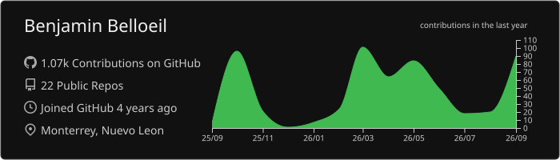
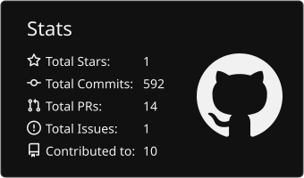
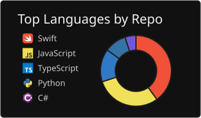

  

    
    
    
    
  

<!-- <picture>
  <source media="(max-width: 840px)" srcset="./assets/engineer.svg?v=1.1" />
  
</picture> -->

 

# Tech stack

**Languages & web**

  
  
  
  
  
  
  
  
  
  
  
  

**Backend, cloud & databases**

  
  
  
  
  
  
  
  
  
  
  
  
  
  
  
  
  

**Science & hardware**

  
  
  
  
  
  
  

**Development tools**

  
  
  
  
  
  
  
  
  
  
  

**Design & collaboration**

  
  
  
  
  
  
  
  
  

 

# GitHub activity

 

# Something extra

<a href="https://open.spotify.com/user/74s9ly4x7b0vrvlyzmx9iwr3w">
    <picture>
      <source media="(max-width: 600px)" srcset="https://spotify-recently-played.jeffreyca.workers.dev/svg?user=74s9ly4x7b0vrvlyzmx9iwr3w&amp;count=3&amp;unique=true&amp;width=400&amp;theme=dark&amp;bg_color=111111&amp;text_color=F1F1F1&amp;artist_color=CACACA&amp;meta_color=A0A0A0&amp;accent_color=BBBBBB&amp;logo_color=DDDDDD" />
      
    </picture>
  </a>

<!-- 

  <picture data-importer="pacman">
    <source media="(prefers-color-scheme: dark)" srcset="./assets/galaga-contribution-graph-dark.svg" />
    <source media="(prefers-color-scheme: light)" srcset="./assets/galaga-contribution-graph.svg" />
    
  </picture>

 -->

